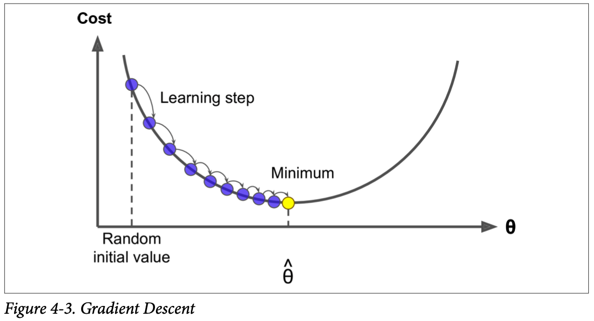
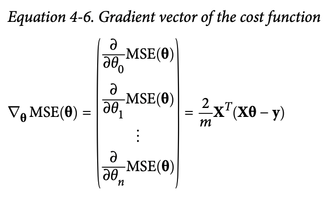

## 1.Linear Regression
Linear regression model prediction
$$\hat{y}  = \theta_{0} + \theta_{1}x_1 + \theta_{2}x_2 + ... + \theta_{n}x_n$$

- To train a Linear Regression model, we need to find the value of $\theta$ that minimize the mean squared error (MSE). MSE cost function for Linear Regression model
$$MSE(X, h_{\theta}) = \frac{1}{m_i}\sum^{m}_{i=1}(\theta^Tx^i-y^i)^2$$
### 1.1 The Normal Equation
To find the value of $\theta$ that minimizes the cost function, there is a closed form solution. Which is  called the Normal Equation
$$\hat{\theta} = (X^{T}X)^{-1} X^{T}y$$
### 1.2 Computational Complexity
pass

----
## 2.Gradient Descent

- Learning rate: the size of the steps. If small -> many iteration

- Trainig a model neans searching for a combination of model parameters that minimizes a cost function: it's a search in the model's parameter space

### 2.1 Batch Gradient Descent
To implement gradient Descent, we need to compute **partial derivative** - how much the cost function will change if you change $\theta_j$ just a little bit

- partial derivative of the cost fucntion with regard to parameter $\theta_j$
$$\frac{\partial}{\partial\theta_j}MSE(\theta) = \frac{2}{m}\sum_{i-1}^{m}(\theta^Tx^i-y^i)s_j^i$$

- CONS: The formula involves calculation over the full training set X -> very slow

### 2.2 Stochastic Gradient Descent
- Pick a random instance in the training set at every step and computes the gradients base only on the single instance
- PROS: faster than batch
- CONS: Less regular than batch. The const function will bounce up and down

### 2.3 Mini-batch Gradient Descent
- Computes the gradients on small random sets of instances called mini-batches

----

## 3.Polynomial Regression
pass

## 4.Learning Curves

## 5.Regularized Linear Models
A good way to reduce overfitting is to regularize te model: the fewer degree of freedom it has, the harder it will be for it to overfit the data
- For polynomial model -> reduce the num of poly deg
- For linear model: (1) Ridge Regression (2) Lasso Regression (3) Elastic Net

### 5.1 Ridge Regression
Added a  regularization term $\alpha\sum^{n}_{i=1} \theta_i^2$ to the cost function. s.t. the learning algorithm not only fit the data but also keep the model weights as small as possible

Ridge Regression cost function:
$$J(\theta) = MSE(\theta) + \alpha\sum^{n}_{i=1} \theta_i^2$$

### 5.2 Lasso Regression
Similar to Ridge, but use different regularization term
$$J(\theta) = MSE(\theta) + \alpha\sum^{n}_{i=1} |\theta_i|$$

Characteristics: Lasso Regression automatically performs feature selection and outputs a sparse model

#### Ridge vs Lasso
(1) Lasso 's gradients get smaller as the params approach global optimum, so Gradient Descent natually slows down, which help convergences
(2) Lasson's optimal parameters get closer to the origin when you increase $\alpha$, but they never get eliminated entirely

### 5.3 Elastic Net
Between Ridge and Lasso: When r=0, equiv to Ridge, when r = 1, equiv to Lasso

#### How to choose
- Ridge is a good default.
- Lasso or Elastic if you suspect only few features are imp
- Elastic is better than Lasso in general

### 5.4 Early Stopping
pass

## 6.Logistic Regression
### 6.1 Estimating Probrbilities
### 6.2 Training and Cost Function
### 6.3 Decision Boundaries
### 6.4 Softmax Regression